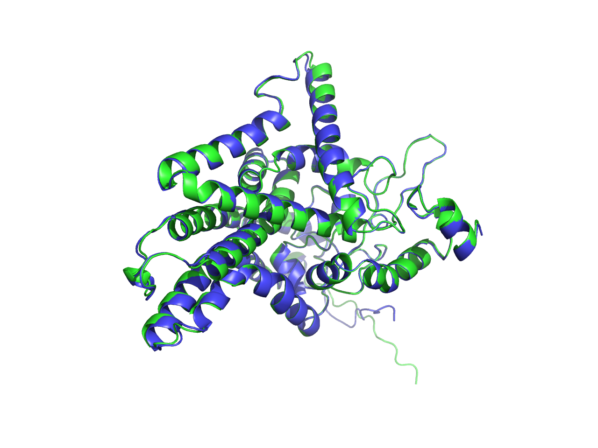
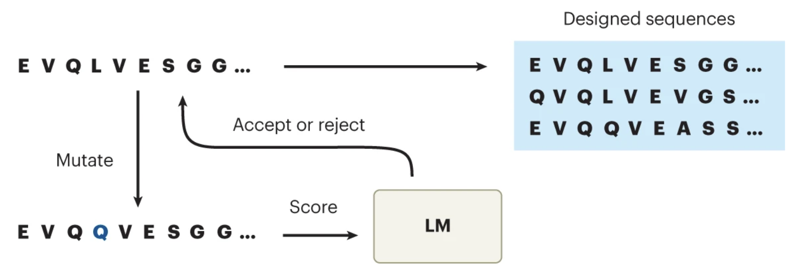

# DL-Guided Cross-Species Gene Sequence Optimization (a VERY NAIVE demo)

> *In-silico horizontal gene transfer*

**This is essentially just an extremely naive demo I played around with before starting uni to get familiarised with the field.**

---

The project was initially developed as the dry-lab component of my high school iGEM team’s synthetic biology project. While entirely illustrative in nature (and independent of our wet-lab experiments, where plasmids for actual biotransformation are transferred across two bacterial species), the primary aim is to deepen my understanding of computational biology. I personally find the field extremely fascinating, and over the past few weeks, the whole process of designing the pipeline, researching algorithms, and implementing (plus so much debugging) the code has been both rewarding and incredibly fun.

The central idea behind the pipeline is that the base model (in this case [Evo-1](https://github.com/evo-design/evo/)) captures general *prokaryotic* genomic patterns, while fine-tuning on the target host species' DNA corpus enables it to learn host-specific contextual information. This, in turn, helps reveal how 'host-like' a candidate sequence is, thereby guiding sequence optimization. This 'mutagenesis' step is carried out via an iterative, directed-evolution–like MH-MCMC sampling procedure, which recursively proposes point mutations on the current sequence while rejecting nonsense mutations and protecting the enzyme's active site from non-synonymous substitutions. Finally, optimized sequences are evaluated by calculating CAI and GC content to assess host compatibility, and by performing structural predictions to visualize the structures of the new proteins (via PyMol) and compute further metrics (pLDDTs and scores for alignment with reference sequence).

Reference: Ruffolo, J.A., Madani, A. Designing proteins with language models. Nat Biotechnol 42, 200–202 (2024). https://doi.org/10.1038/s41587-024-02123-4 *(for the figure above; 'optimizing sequences through Markov chain Monte Carlo sampling with an LM')*

---

## The search for a better sequence...

Trying to balance exploration and exploitation, and avoid enumerating by brute force.

**Gradient-based sensitivity analysis**: by calculating the gradient of the model's loss w.r.t. each position on the current sequence, we can identify the nucleotides *where* mutations would most significantly impact the 'host-likeness' score (a small nudge can lead to greater changes). Rather than mutating positions randomly..., we leverage the model's knowledge to guide the search.

(*Note that this idea isn't applicable with Evo-1 since its StripedHyena architecture doesn't support `inputs_embeds` *(input embeddings are needed since gradients can only flow through continuous tensors rather than discrete ids)* as a kwarg in the `forward()` method... Tried a few workarounds but didn't work as well (so sad). However, a demo of running this check via [Nucleotide Transformer](https://github.com/instadeepai/nucleotide-transformer) (which does support that kwarg; however, due to its way of tokenization, the performance of the analysis is very poor...) can be seen in the notebook. For Evo-1, we'll just randomly propose positions to mutate...*)

**Constrained MH-MCMC sampling**: once we've identified which positions to randomly mutate (*Monte Carlo*), we score the mutated sequence and use Metropolis criterion to decide whether to accept the mutation, and the iteration goes on autoregressively (*a Markov chain*). For those occurring in predefined regions (particularly the enzyme's active site), the new codon must be synonymous to be accepted. Codons that are swapped to stop codons are also automatically rejected.

---

## Limitations of this computational pipeline

(just a naive demo to play around)

1. The greatest one, identified only after running the whole thing - insignificant actual improvement on the metrics. Sad. 

2. Absence of wet-lab validation. The optimized sequence is very likely to fail when synthesized and expressed *in vivo*.

3. Training data is limited to a maximum of only 512 tokens per sequence due to GPU OOMs... (so upsetting). The model now fails to capture long-range dependencies, and its understanding of 'host-likeness' is skewed towards properties of short proteins. However, the full-sequence length of our target alkB gene during inference is much longer...

4. Oversimplification. The optimization relies on a single metric (the generative model's negative log-likelihood), whereas a more robust score should combine multiple measures (CAI, pLDDT, etc). Moreover, the illustration on the active site preservation is way too naive.

5. Hyperparameters might be poorly chosen. This can cause the search in the sequence space to be trapped in local optima, even though the MH-MCMC algorithm (as opposed to a greedy search) is designed to escape them.

---

## Background information about our iGEM project

Our project aims to mitigate plastic pollution by engineering *Streptomyces lividans*, a G+ bacterium abundant in soil, to degrade low-density polyethylene (LDPE). We plan to achieve this by introducing the alkane monooxygenase gene (alkB) from *Rhodococcus erythropolis* and evaluating its efficacy in LDPE breakdown.

---

More details on the pipeline can be found within the notebook cells.
