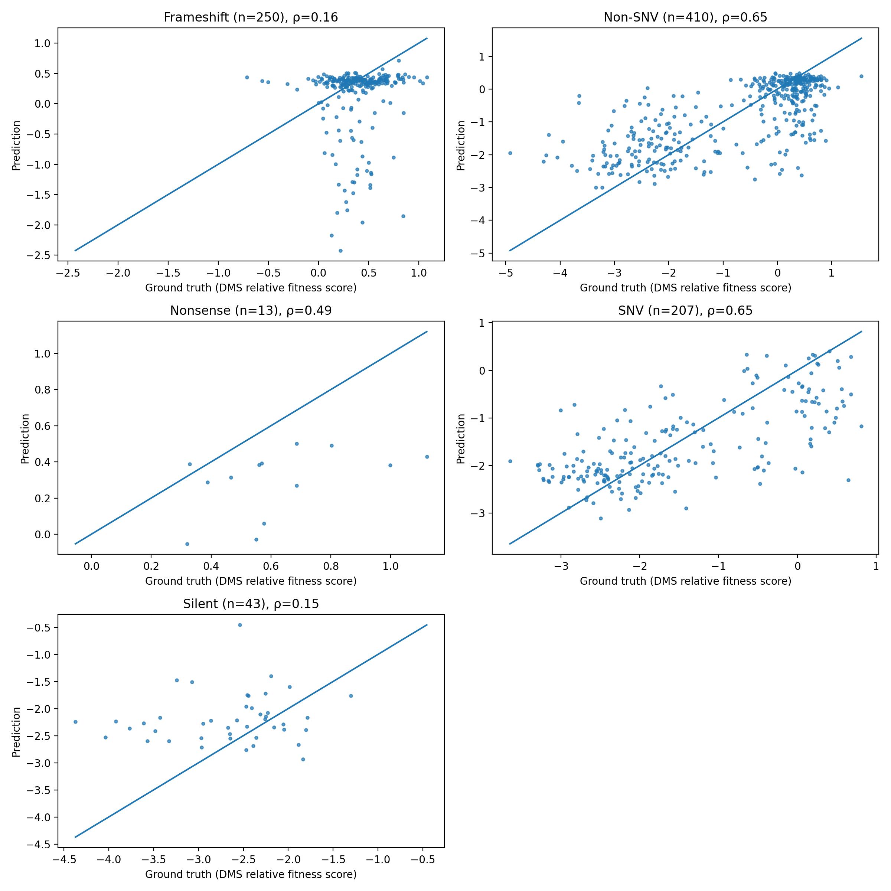
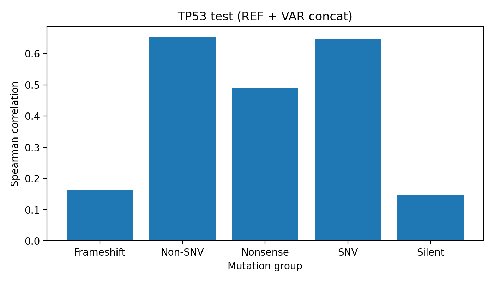

Two small experimental demos during my 2025 winter internship. 

The main workflow was adapted from the [Evo-2](https://www.biorxiv.org/content/10.1101/2025.02.18.638918v1) paper, where the model was assessed on various downstream supervised tasks. These demos modified and applied the pipeline to verify the usability of embeddings extracted from the Evo-2 model, through performing zero-shot VEP on the ClinVar dataset and protein fitness prediction on a [TP53 deep-mutational-scanning (DMS) dataset](https://doi.org/10.1016/j.molcel.2018.06.012). The results suggested that Evo-2 embeddings successfully encode information about variant sequence pathogenicity and protein-level information. 

---

The pipeline consists of:

1. Dataset prep and reference/variant sequence processing. 
   - The ClinVar dataset was prepared according to the original paper.
   - Window length for parsing: 128nt
   - Reference genome: GRCh38

2. Embedding extraction, mean pooling and concatenation. The resulted embeddings are then used as input features for the MLP model.
   - Layer: `blocks.28.mlp.l3` of Evo-2 (7B) 

3. MLP training and evaluation for ClinVar VEP (binary classification) and DMS score prediction (regression). Model architecture and training hyperparameters were adapted from the Evo-2 paper's *Methods*.

---

Performance:

- **ClinVar SNV VEP**:

- **TP53 DMS**:

The embeddings yielded a high Spearman correlation (exceeding 0.6 for SNV and non-SNV substitutions) for predicting protein fitness. This performance surpasses the correlation reported for Evo-2's log-likelihood scores in the original paper (below 0.4), indicating that the embeddings effectively capture protein-level functional information.

